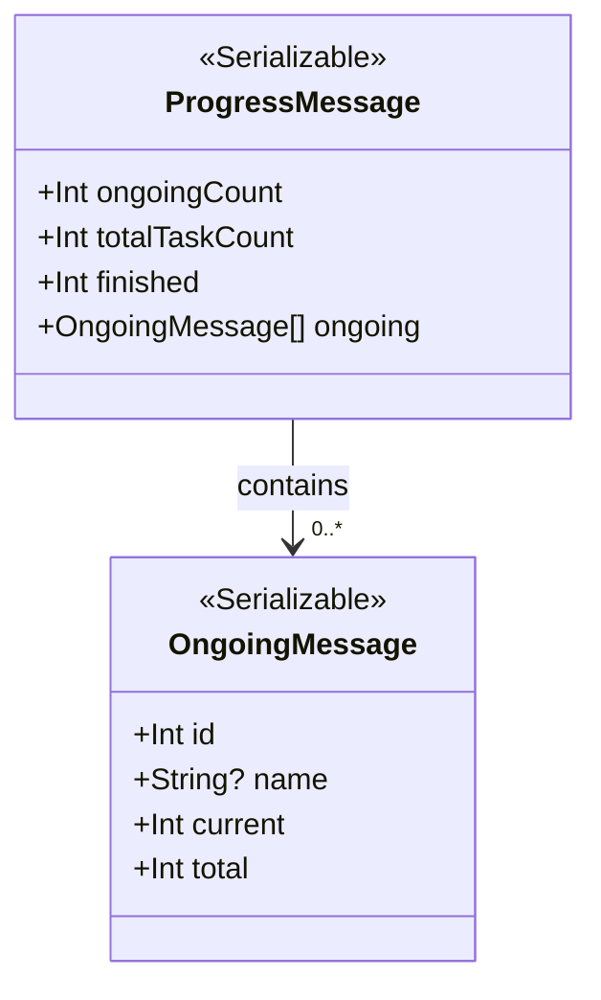
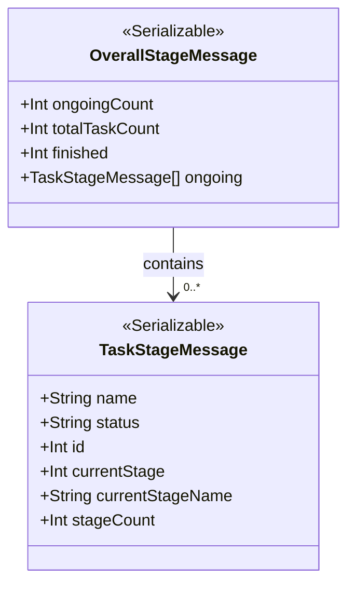

# HTTPServer

## Description

An HTTP server that can add route in modules. There are some default servers offered.

## How to add a new route

The web server is started in class `HTTPServer`, it's used as global interface in default.

The default server is at `0.0.0.0:31778`.

If you want to add new route, you can create a class `newServer` implementing the class `DynamicServer` and add annotation `@RouteRequestMethod(...)` to specify the request method.

```kotlin
@RouteRequestMethod(["POST", "GET"])        // Only GET and POST is supported now
// DynamicServer arguments: server name, server route
class YourServer : DynamicServer("YourServer", "/path/of/your/route") {
  // Add your code here...
}
```

You need to override `respondPost` and `respondGet` to implement your own logic for POST and GET requests.

## Default servers

### `ProgressServer`

- Route: `/progress`
- Method: POST
- Respond data format: JSON
- Parameters:
    - "id": Optional, if not specified, it will return all progresses

Data responded without "id":



Data responded with "id": only a `OngoingMessage`

`/scripts/match_progress_monitor.py` can interact with this server and show progress bars of the ongoing matching tasks.

### `TaskStageServer`

- Route: `/task_stages`
- Method: POST
- Respond data format: JSON
- Parameters:
    - "id": Optional, if not specified, it will return all task stages

Data responded without "id":



Data responded with "id": only a `TaskStageMessage`, if `id` does not exist, the name will be 'error' and the status will be 'no such stage'.

`/scripts/task_stage_monitor.py` can interact with this server and show stages of the ongoing binary tasks.